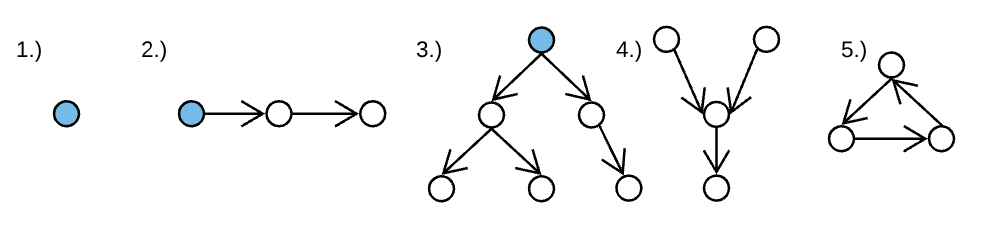

# Trees

Created By: Chris Trinh
Last Edited: Dec 23, 2019 9:30 AM

**Binary Trees**

- Which are the above are considered trees?
    - 1, 2, and 3 because they all begin with a single node
- What is a graph?
    - Collection of nodes(circles) and edges(arrows) between those nodes
    - A single node without edges is considered a graph
    - Empty graph ( 0 nodes and 0 edges ) are pictured
- What is a tree?
    - A graph that does not contain any cycles
        - Cycles are path through edges that begins and ends at the same node
- What is a binary tree?
    - A tree where nodes have at most 2 children
    - an empty graph of 0 nodes and 0 edges is a binary tree
    - a graph of 1 node and 0 edges is a binary tree
    - a linked list is a binary tree
- What does a Tree with node instances look like?

        class TreeNode {
            constructor(val) {
                this.val = val;
                this.left = null;
                this.right = null;
            }
        }

- What is a root?
    - the ultimate parent, the single node of a tree that can access every other node through edges; by definition the root will not have a parent
- What is an internal node?
    - a node that has children
- What is a leaf?
    - a node that does not have any children
- What is a path?
    - a series of nodes that can be traveled through edges - for example A, B, E is a path through the above tree

**In-Order**

- What is the general algorithm?

        - print all nodes in the left subtree
        - print root
        - print all nodes in the right subtree

- What is the pattern?
    - left, self, right
    - a node can only be printed once it's left subtree has been completely printed.
    - a node's right subtree can only be printed once the node itself has been printed.
- What does the general function look like in code?

        function inOrderPrint(root) {
            if (!root) return;
        
            inOrderPrint(root.left);
            console.log(root.val);
            inOrderPrint(root.right);
        }

**Pre-Order**

- What is the general algorithm?

        - print root
        - print all nodes in the left subtree
        - print all nodes in the right subtree

- What is the pattern?
    - self, left, right
    - a node must be printed before it's children
    - a node's left subtree must be printed before it's right subtree
- What does the general function look like in code?

        function preOrderPrint(root) {
            if (!root) return;
        
            console.log(root.val);
            preOrderPrint(root.left);
            preOrderPrint(root.right);
        }

**Post-Order**

- What is the general algorithm?

        - print all nodes in the left subtree
        - print all nodes in the right subtree
        - print root

- What is the pattern?
    - left, right, self
    - a node can only be printed after it's left and right subtrees
    - a node's left subtree is printed before it's right subtree
- What does the general function look like in code?

        function postOrderPrint(root) {
            if (!root) return;
        
            preOrderPrint(root.left);
            preOrderPrint(root.right);
            console.log(root.val);
        }

**Depth First Traversal**

- What is the general conceptualization?
    - It will travel deeper into a tree before switching branches meaning we must visit all descendants before visiting its sibling.
- What data structure is used in this algorithm?
    - Stack
- What is the code?

        function depthFirst(root) {
            let stack = [ root ];
            while (stack.length) {
                let node = stack.pop();
                console.log(node.val);
                if (node.right) stack.push(node.right);
                if (node.left) stack.push(node.left);
            }
        }

- Which of the order is identical to depth first?
    - Pre-Order

Breadth First Traversal

- What is the general conceptualization?
    - This algorithm will visit the node across a level, before moving to the next level. It will always move laterally before it goes deeper into the tree.
- What data structure is used in this algorithm?
    - Queue
- What is the code?

        function breadthFirst(root) {
            let queue = [ root ];
            while (queue.length) {
                let node = queue.shift();
        
                console.log(node.val);
        
                if (node.left) queue.push(node.left);
                if (node.right) queue.push(node.right);
            }
        }